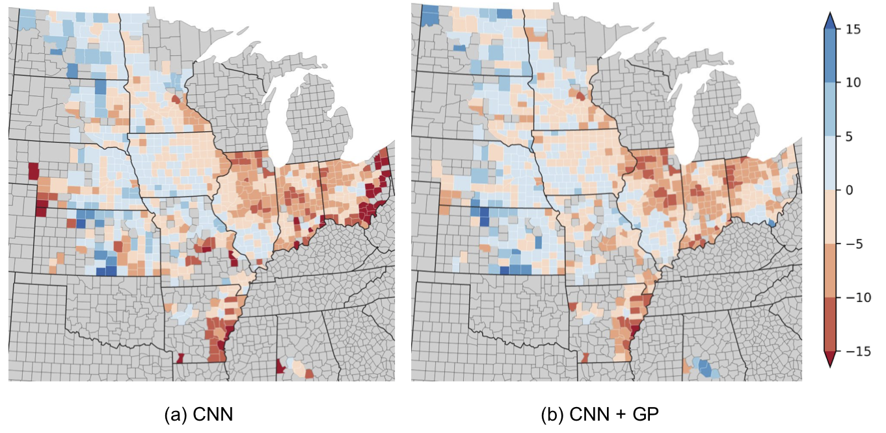

# PyCrop Yield Prediction

A PyTorch implementation of [Jiaxuan You](https://cs.stanford.edu/~jiaxuan/)'s 2017 Crop Yield Prediction Project.

> [Deep Gaussian Process for Crop Yield Prediction Based on Remote Sensing Data](https://cs.stanford.edu/~ermon/papers/cropyield_AAAI17.pdf)

This paper won the Food Security Category from the World Bank's 
[2017 Big Data Innovation Challenge](http://www.worldbank.org/en/news/feature/2017/03/27/and-the-winners-of-the-big-data-innovation-challenge-are).

## Introduction

This repo contains a PyTorch implementation of the Deep Gaussian Process for Crop Yield Prediction. It draws from the
original [TensorFlow implementation](https://github.com/JiaxuanYou/crop_yield_prediction).

Deep Gaussian Processes combine the expressivity of Deep Neural Networks with Gaussian Processes' ability to leverage
spatial and temporal correlations between data points.

In this pipeline, a Deep Gaussian Process is used to predict soybean yields in US counties.

### Results

These results were generated using early stopping with a patience of 10. They can be replicated by running the pipeline
with all the default arguments.

* A comparison of RMSE of the two models, with and without the Gaussian Process. As in the original paper, this was
generated by averaging the results of two runs, to account for random initialization in the neural network:

| Year | LSTM    | LSTM + GP | CNN    | CNN + GP |
|:----:|:-------:|:---------:|:------:|:--------:|
|2009  |**5.18** |6.37       |6.07    |5.56      |
|2010  |7.27     |7.30       |**6.75**|7.03      |
|2011  |6.82     |6.72       |6.77    |**6.40**  |
|2012  |7.01     |6.46       |5.91    |**5.72**  |
|2013  |5.91     |**5.83**   |6.41    |6.00      |
|2014  |5.99     |**4.65**   |5.28    |4.87      |
|2015  |6.14     |**5.13**   |6.18    |5.36      |

* A plot of errors of the CNN model for the year 2014, with and without the Gaussian Process. The color represents prediction error, 
in bushel per acre:




## Pipeline

The main entrypoint into the pipeline is [`run.py`](run.py). The pipeline is split into 4 major components. Note that
each component reads files from the previous step, and saves all files that later steps will need, into the 
[`data`](data) folder.

Parameters which can be passed in each step are documented in [`run.py`](run.py). The default parameters are all taken
from the original repository.

[Python Fire](https://github.com/google/python-fire) is used to generate command line interfaces.

#### Exporting

```bash
python run.py export
```

Exports data from the Google Earth Engine to Google Drive. Note that to make the export more efficient, all the bands
from a county - across all the export years - are concatenated, reducing the number of files to be exported.

To download the data used in the paper ([MODIS](data/README.md#MODIS) images of the top 11 soybean producing states in the US) requires
just over **110 Gb** of storage. This can be done in steps - the export class allows for checkpointing.

#### Preprocessing

```bash
python run.py process
```

Takes the exported and downloaded data, and splits the data by year. In addition, the temperature and reflection `tif` 
files are merged, and the mask is applied so only farmland is considered. Files are saved as `.npy` files.

The size of the processed files is **97 GB**. Running with the flag `delete_when_done=True` will 
delete the `.tif` files as they get processed.

#### Feature Engineering

```bash
python run.py engineer
``` 
Take the processed `.npy` files and generate histogams which can be input into the models.

#### Model training

```bash
python run.py train_cnn
```
and
```bash
python run.py train_rnn
```

Trains CNN and RNN models, respectively, with a Gaussian Process. The trained models are saved in 
`data/models/<model_type>` and results are saved in csv files in those folders. If a Gaussian Process is used, the
results of the model without a Gaussian Process are also saved for analysis.

## Setup

[Anaconda](https://www.anaconda.com/download/#macos) running python 3.7 is used as the package manager. To get set up
with an environment, install Anaconda from the link above, and (from this directory) run

```bash
conda env create -f environment.yml
```
This will create an environment named `crop_yield_prediction` with all the necessary packages to run the code. To 
activate this environment, run

```bash
conda activate crop_yield_prediction
```

Running this code also requires you to sign up to [Earth Engine](https://developers.google.com/earth-engine/). Once you 
have done so, active the `crop_yield_prediction` environment and run

```bash
earthengine authenticate
```

and follow the instructions. To test that everything has worked, run

```bash
python -c "import ee; ee.Initialize()"
```

Note that Earth Engine exports files to Google Drive by default (to the same google account used sign up to Earth Engine.)
